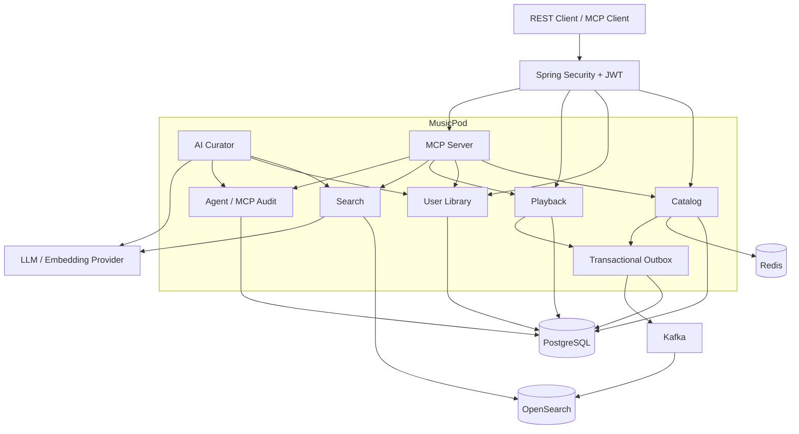
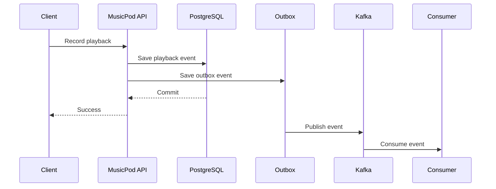
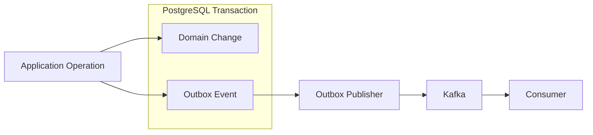
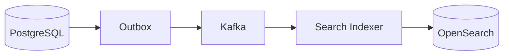
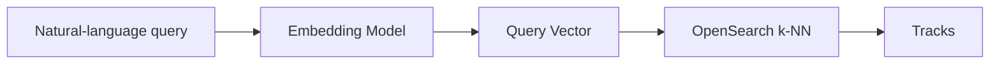
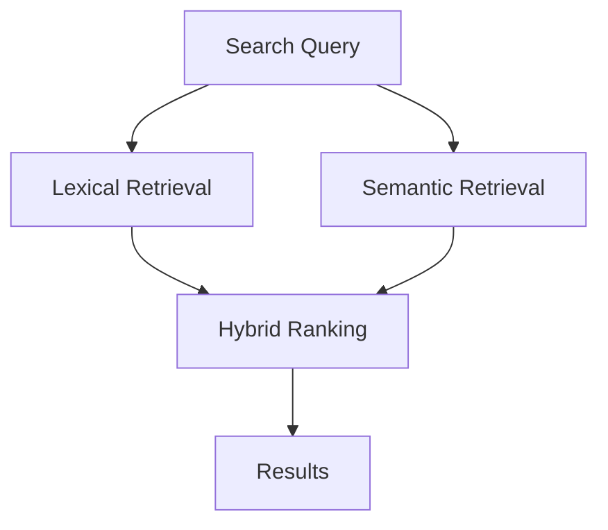
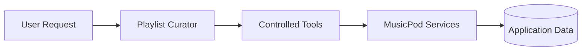
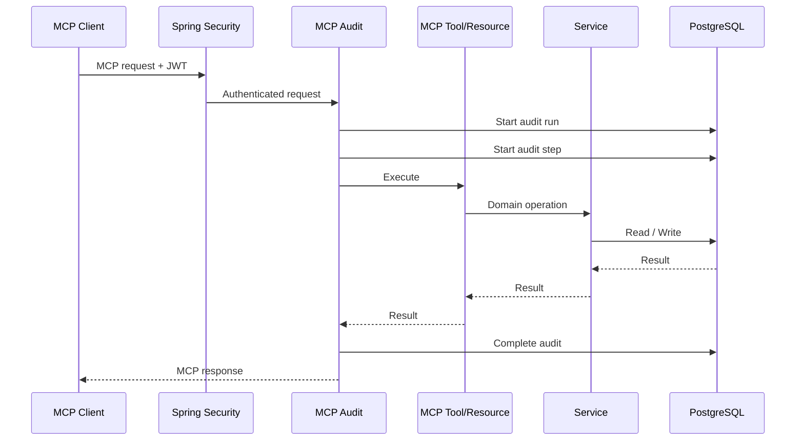

# MusicPod - AI assisted playlist

It includes music catalog management, user libraries, playlists, playback history, hybrid search, AI-assisted playlist curation, and an authenticated Model Context Protocol server.

PostgreSQL is the primary datastore. Kafka is used for asynchronous processing, Redis for caching, and OpenSearch for catalog search and vector retrieval.

The application is currently implemented as a modular backend, with domain boundaries separated in code while sharing the same runtime and infrastructure.

## Highlights

* Artist, album, and track catalog
* JWT authentication and user-scoped operations
* Liked tracks, playlists, and recently played history
* Kafka-based event processing
* Transactional outbox for reliable event publication
* Redis caching
* OpenSearch catalog indexing
* Lexical, semantic, and hybrid track search
* AI-assisted playlist curation
* Controlled AI write operations
* MCP tools and resources over Streamable HTTP
* Authentication and ownership checks for personalized MCP operations
* Persistent audit history for AI and MCP executions
* Flyway-managed PostgreSQL schema
* Docker Compose development environment
* Automated unit and integration tests

---

## Architecture



PostgreSQL remains the source of truth for application data.

Redis contains cached representations, and OpenSearch contains a search-optimized representation of the catalog. Kafka is used to move work that does not need to complete inside the request path.

---

## Tech Stack

| Area                      | Technology                    |
| ------------------------- | ----------------------------- |
| Backend                   | Java, Spring Boot             |
| API                       | REST                          |
| Authentication            | Spring Security, JWT          |
| Database                  | PostgreSQL                    |
| Persistence               | Spring Data JPA, Hibernate    |
| Database migrations       | Flyway                        |
| Messaging                 | Apache Kafka                  |
| Reliable event publishing | Transactional Outbox          |
| Cache                     | Redis                         |
| Search                    | OpenSearch                    |
| Semantic retrieval        | Vector embeddings             |
| AI integration            | Spring AI                     |
| AI interoperability       | Model Context Protocol        |
| MCP transport             | Streamable HTTP               |
| Local infrastructure      | Docker Compose                |
| Build                     | Maven                         |
| Testing                   | JUnit 5, Mockito, Spring Test |

---

# Domain Model

The main catalog hierarchy is:

```text
Artist
  └── Album
       └── Track
```

User-specific data is kept separately:

```text
User
 ├── LikedTrack ───────── Track
 │
 ├── PlaybackEvent ────── Track
 │
 └── Playlist
      └── PlaylistTrack ─ Track
```

This keeps the shared catalog independent from user-specific relationships.

---

# Catalog

MusicPod supports management of artists, albums, and tracks.

A track belongs to an album, and an album belongs to an artist.

Typical operations include:

```text
Create artist
Create album for artist
Create track for album
Retrieve track
Update catalog metadata
Delete catalog entries
```

Controllers handle HTTP concerns while business rules remain in the service layer.

```text
Request
   ↓
Controller
   ↓
Service
   ↓
Repository
   ↓
PostgreSQL
```

DTOs are returned through the API rather than exposing JPA entities directly.

---

# Authentication

MusicPod uses JWT authentication.

After login, authenticated API calls include:

```http
Authorization: Bearer <access-token>
```

User-specific operations derive the current user from the authenticated security context.

Clients do not supply a user ID for operations such as retrieving liked tracks or recently played music.

```text
JWT
 ↓
Spring Security
 ↓
Current authenticated user
 ↓
Application service
```

This same identity model is used by the REST API, AI workflows, and personalized MCP operations.

---

# User Library

## Liked Tracks

Users can:

* like a track
* unlike a track
* retrieve their liked tracks

The relationship between a user and a track is stored separately from the catalog itself.

Duplicate likes are handled safely so repeated requests do not create duplicate relationships.

---

## Playlists

Users can:

* create playlists
* retrieve their playlists
* retrieve a playlist by ID
* update playlists
* delete playlists
* add tracks
* add multiple tracks

Playlist access is scoped to the authenticated owner.

A playlist ID by itself is not enough to access a private playlist. The service resolves it using both the current user and the playlist ID.

```text
Authenticated user
       +
Playlist ID
       ↓
PlaylistService
       ↓
Owned playlist
```

Track addition is idempotent. Repeating the same request does not create duplicate playlist-track relationships.

---

# Playback History

Playback activity is stored as individual events.

For example:

```text
10:03 → Track A
10:07 → Track B
10:12 → Track A
```

Each play remains a separate event rather than replacing a single "last played" value.

This provides the data used for recently played history and asynchronous playback processing.

---

# Event Processing

MusicPod uses Kafka for work that does not need to complete during the original API request.

For example:



This keeps asynchronous consumers independent from the request path.

---

# Transactional Outbox

Publishing directly to Kafka after a database write introduces a dual-write problem.

Consider this sequence:

```text
Save playback event
        ↓
Commit database transaction
        ↓
Publish Kafka event
```

If the process stops between the database commit and Kafka publication, the playback exists but the event is lost.

MusicPod instead writes the domain change and the corresponding outbox entry in the same database transaction.

```text
BEGIN TRANSACTION

Save domain data

Save outbox event

COMMIT
```

The outbox publisher later publishes the event to Kafka.



This avoids requiring a distributed transaction between PostgreSQL and Kafka.

---

# Redis Caching

Frequently accessed track data is cached in Redis.

```text
Track request
    ↓
Redis
 ┌──┴─────────────┐
 HIT              MISS
  ↓                 ↓
Return          PostgreSQL
                    ↓
                Cache value
                    ↓
                  Return
```

Database writes invalidate the appropriate cache entry.

PostgreSQL remains authoritative. Redis is only an optimization.

---

# Search

MusicPod uses OpenSearch rather than querying PostgreSQL directly for all search traffic.

Track search documents contain information such as:

* track title
* artist
* album
* searchable text
* semantic representation
* embedding vector

Catalog changes are propagated to the search index asynchronously.



The search index is therefore eventually consistent with the transactional catalog.

---

# Lexical Search

Lexical search handles queries where the user knows part of the title, artist, or album.

Examples:

```text
Coldplay
Clocks
Rush of Blood
Kishore Kumar
```

OpenSearch performs relevance-based matching over indexed catalog fields.

---

# Semantic Search

Semantic search supports queries that describe what the listener wants rather than naming a particular song.

Examples:

```text
quiet music for a rainy evening

romantic old Hindi songs

music for a late night drive

high energy workout songs
```

The query is converted into an embedding and compared against vectors stored with track search documents.



---

# Hybrid Search

MusicPod combines lexical and semantic retrieval.

This is useful because different queries have different intent.

An exact query such as:

```text
Clocks Coldplay
```

benefits heavily from lexical matching.

A query such as:

```text
melancholic music for a rainy evening
```

benefits more from semantic retrieval.

Hybrid search combines both signals before returning results.



The search layer also resolves explicit artist references when possible so a natural-language query can retain artist intent.

---

# AI Playlist Curator

MusicPod includes an AI-assisted playlist curator.

The model does not have direct database access.

Instead, it works through application-level tools.



Available operations can include:

```text
Search tracks
Read liked tracks
Read recently played tracks
Create playlist
Add tracks to playlist
```

Read and write capabilities are kept separate.

A workflow that is not permitted to make changes does not receive unrestricted write access.

---

# AI Execution Audit

AI executions are persisted in two levels:

```text
agent_runs
agent_steps
```

A run represents the overall operation.

A step represents an individual tool execution within the run.

For example:

```text
Run: "Create a road trip playlist"

  Step 1 → search_tracks
  Step 2 → get_liked_tracks
  Step 3 → create_playlist
  Step 4 → add_tracks
```

The audit data includes information such as:

* authenticated user
* execution status
* write permission
* tool name
* tool risk
* sanitized input
* sanitized output
* execution duration
* failure information
* timestamps

Sensitive values are sanitized before being persisted.

---

# Model Context Protocol

MusicPod runs an MCP server alongside the REST application.

The endpoint is:

```text
/mcp
```

and uses Streamable HTTP.

MCP clients can discover MusicPod capabilities and use them without requiring a MusicPod-specific client SDK.

---

## MCP Tools

The server currently exposes six tools.

| Tool                              | Purpose                                  | Access |
| --------------------------------- | ---------------------------------------- | ------ |
| `musicpod_search_tracks`          | Search the catalog                       | Read   |
| `musicpod_get_track`              | Retrieve a track                         | Read   |
| `musicpod_get_liked_tracks`       | Retrieve current user's liked tracks     | Read   |
| `musicpod_get_recently_played`    | Retrieve current user's playback history | Read   |
| `musicpod_create_playlist`        | Create a playlist                        | Write  |
| `musicpod_add_tracks_to_playlist` | Add tracks to a playlist                 | Write  |

Personalized tools do not expose a `userId` parameter.

The user is resolved from the JWT associated with the MCP request.

---

## MCP Resources

Two resource templates are exposed.

### Track

```text
musicpod://tracks/{trackId}
```

Returns track information as JSON.

### Owned Playlist

```text
musicpod://me/playlists/{playlistId}
```

Returns playlist information only when the playlist belongs to the authenticated user.

---

## MCP Request Flow



MCP calls reuse the application's service layer instead of bypassing domain logic.

---

# MCP Auditing

MCP tool and resource executions use the same durable run/step audit model used by the AI workflows.

Each invocation records a run and a step.

Example operation names include:

```text
musicpod_search_tracks

musicpod_get_liked_tracks

musicpod_create_playlist

musicpod_resource_track

musicpod_resource_owned_playlist
```

Operations are classified as:

```text
READ_ONLY
WRITE
```

For write operations, the audit trail records that mutation was permitted.

Validation errors are also captured because validation happens inside the audited execution path.

---

# API Examples

<details>
<summary><strong>Login</strong></summary>

```bash
curl \
  -X POST \
  http://localhost:8080/api/v1/auth/login \
  -H "Content-Type: application/json" \
  -d '{
    "email":"listener@example.com",
    "password":"your-password"
  }'
```

Save the returned access token:

```bash
TOKEN="<access-token>"
```

</details>

<details>
<summary><strong>Get the current user</strong></summary>

```bash
curl \
  -H "Authorization: Bearer $TOKEN" \
  http://localhost:8080/api/v1/me
```

</details>

<details>
<summary><strong>Create an artist</strong></summary>

```bash
curl \
  -X POST \
  http://localhost:8080/api/v1/artists \
  -H "Authorization: Bearer $TOKEN" \
  -H "Content-Type: application/json" \
  -d '{
    "name":"Coldplay"
  }'
```

</details>

<details>
<summary><strong>Create an album</strong></summary>

```bash
curl \
  -X POST \
  http://localhost:8080/api/v1/artists/$ARTIST_ID/albums \
  -H "Authorization: Bearer $TOKEN" \
  -H "Content-Type: application/json" \
  -d '{
    "title":"A Rush of Blood to the Head",
    "releaseDate":"2002-08-26"
  }'
```

</details>

<details>
<summary><strong>Create a playlist</strong></summary>

```bash
curl \
  -X POST \
  http://localhost:8080/api/v1/me/playlists \
  -H "Authorization: Bearer $TOKEN" \
  -H "Content-Type: application/json" \
  -d '{
    "name":"Evening Drive",
    "description":"Music for a late drive"
  }'
```

</details>

<details>
<summary><strong>Search tracks</strong></summary>

```bash
curl \
  -H "Authorization: Bearer $TOKEN" \
  "http://localhost:8080/api/v1/search/tracks?q=romantic%20Kishore%20Kumar%20songs&size=10"
```

</details>

---

# MCP Examples

The MCP server can be exercised with the MCP Inspector CLI.

<details>
<summary><strong>List MCP tools</strong></summary>

```bash
npx -y @modelcontextprotocol/inspector@latest \
  --cli \
  --server-url http://localhost:8080/mcp \
  --transport http \
  --header "Authorization: Bearer $TOKEN" \
  --method tools/list
```

</details>

<details>
<summary><strong>Search tracks</strong></summary>

```bash
npx -y @modelcontextprotocol/inspector@latest \
  --cli \
  --server-url http://localhost:8080/mcp \
  --transport http \
  --header "Authorization: Bearer $TOKEN" \
  --method tools/call \
  --tool-name musicpod_search_tracks \
  --tool-args-json \
  '{"query":"Coldplay","size":5}'
```

</details>

<details>
<summary><strong>Get liked tracks</strong></summary>

```bash
npx -y @modelcontextprotocol/inspector@latest \
  --cli \
  --server-url http://localhost:8080/mcp \
  --transport http \
  --header "Authorization: Bearer $TOKEN" \
  --method tools/call \
  --tool-name musicpod_get_liked_tracks \
  --tool-args-json \
  '{"page":0,"size":10}'
```

</details>

<details>
<summary><strong>Create a playlist</strong></summary>

```bash
npx -y @modelcontextprotocol/inspector@latest \
  --cli \
  --server-url http://localhost:8080/mcp \
  --transport http \
  --header "Authorization: Bearer $TOKEN" \
  --method tools/call \
  --tool-name musicpod_create_playlist \
  --tool-arg name="Evening Drive" \
  --tool-arg description="Music for a late drive"
```

</details>

<details>
<summary><strong>List resource templates</strong></summary>

```bash
npx -y @modelcontextprotocol/inspector@latest \
  --cli \
  --server-url http://localhost:8080/mcp \
  --transport http \
  --header "Authorization: Bearer $TOKEN" \
  --method resources/templates/list
```

The server exposes:

```text
musicpod://tracks/{trackId}

musicpod://me/playlists/{playlistId}
```

</details>

<details>
<summary><strong>Read a track resource</strong></summary>

```bash
npx -y @modelcontextprotocol/inspector@latest \
  --cli \
  --server-url http://localhost:8080/mcp \
  --transport http \
  --header "Authorization: Bearer $TOKEN" \
  --method resources/read \
  --uri "musicpod://tracks/$TRACK_ID"
```

</details>

---

# Running Locally

## Requirements

You will need:

* Java
* Maven
* Docker
* Docker Compose
* an OpenAI API key for AI and embedding features

---

## 1. Clone the Repository

```bash
git clone <repository-url>
cd MusicPod/musicpod-backend
```

---

## 2. Configure the AI Provider

```bash
export OPENAI_API_KEY="<your-api-key>"
```

---

## 3. Start Infrastructure

```bash
docker compose up -d
```

Check container status:

```bash
docker compose ps
```

The local environment includes PostgreSQL, Kafka, Redis, and OpenSearch.

---

## 4. Start MusicPod

```bash
mvn spring-boot:run
```

The default application port is:

```text
8080
```

To use another port:

```bash
export SERVER_PORT=8081
mvn spring-boot:run
```

---

# Configuration

Database settings can be overridden through environment variables.

```text
DB_HOST
DB_PORT
DB_NAME
DB_USER
DB_PASSWORD
SERVER_PORT
```

Default database configuration:

```text
host      localhost
port      5432
database  musicpod
username  musicpod
password  musicpod
```

The corresponding JDBC URL is:

```text
jdbc:postgresql://localhost:5432/musicpod
```

Flyway migrations are loaded from:

```text
src/main/resources/db/migration
```

Hibernate validates the database schema rather than creating it automatically.

---

# Repository Layout

```text
MusicPod/
└── musicpod-backend/
    ├── src/
    │   ├── main/
    │   │   ├── java/com/musicpod/
    │   │   │   ├── ai/
    │   │   │   ├── analytics/
    │   │   │   ├── auth/
    │   │   │   ├── catalog/
    │   │   │   │   ├── album/
    │   │   │   │   ├── artist/
    │   │   │   │   └── track/
    │   │   │   ├── common/
    │   │   │   ├── config/
    │   │   │   ├── library/
    │   │   │   │   ├── likedtrack/
    │   │   │   │   └── playlist/
    │   │   │   ├── mcp/
    │   │   │   ├── messaging/
    │   │   │   │   ├── event/
    │   │   │   │   ├── kafka/
    │   │   │   │   └── outbox/
    │   │   │   ├── playback/
    │   │   │   └── search/
    │   │   └── resources/
    │   │       ├── application.yml
    │   │       └── db/migration/
    │   │
    │   └── test/
    │
    ├── compose.yml
    └── pom.xml
```

---

# Testing

Run the complete test suite:

```bash
mvn test
```

Run the MCP tests:

```bash
mvn test -Dtest='MusicPodMcp*Tests'
```

Compile application sources:

```bash
mvn compile
```

The test suite covers the main application services, APIs, search behavior, AI workflows, MCP tools and resources, validation, authentication, and authorization boundaries.

---

# Data and Consistency

Not every component uses the same consistency model.

PostgreSQL is authoritative for transactional application state.

```text
PostgreSQL
    |
    +-- catalog
    +-- users
    +-- likes
    +-- playlists
    +-- playback
    +-- audit records
```

Other systems maintain derived state:

```text
Redis       → cached state

OpenSearch  → searchable state

Kafka       → asynchronous event stream
```

OpenSearch indexing and Kafka consumers are therefore eventually consistent with PostgreSQL.

A temporary problem in a derived system should not change the committed state in the primary database.

---

# A Note on Service Boundaries

MusicPod is deliberately kept as a modular application for now.

The code is separated by functional area, including catalog, library, playback, search, messaging, AI, and MCP, but these modules run inside the same Spring Boot application.

That avoids introducing network boundaries where they are not yet necessary while keeping the code organized so individual areas could be separated later if their scaling or operational requirements diverged.

---

# License

This project is intended for learning, experimentation, and portfolio use.
